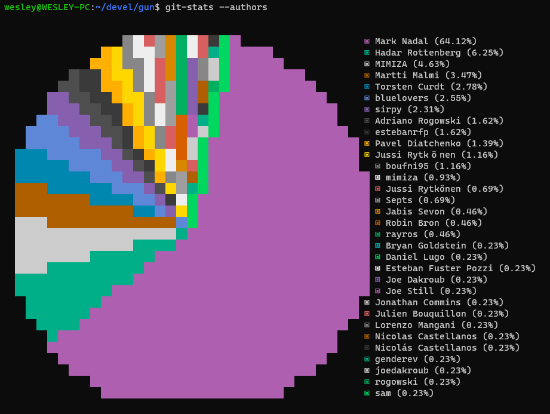
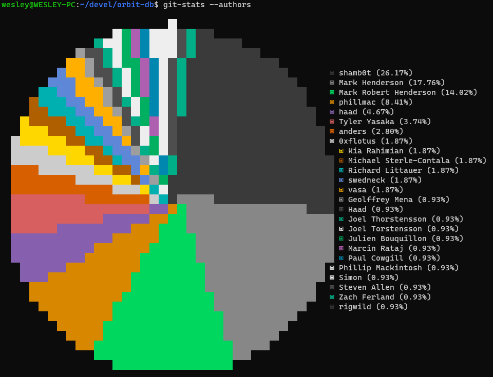
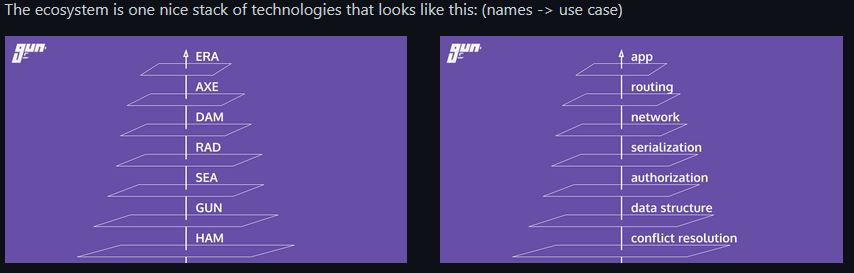
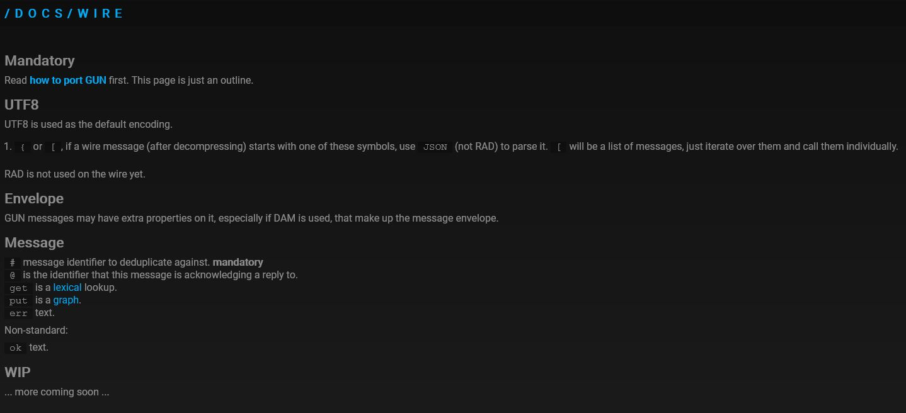

[Gun](https://gun.eco/) (Photosensitive Warning: Obnoxious neon colors as background) is getting more [mainstream attention](https://mobile.twitter.com/jack/status/1352442460127936512), I'll weight this projects advantages against its drawbacks.


# The Good

## The Community
I've been lurking the gun community (and it _is_ a community) since September 2018. They are very active and are very "newbie friendly"

## Cool Ideas
Gun uses [CRDTs](https://en.wikipedia.org/wiki/Conflict-free_replicated_data_type) which I beleive will be standard is every distributed database.

Graph databases are cool. A graph is the superset of all data structures. The idea of a Universe of nodes (Graph UNIVERSE Node) that interlink all data is cool.

But Gun fails in the execution.


# The Bad

## Misleading Claims and Bad Expectation Management

### Performance
Gun makes some [outrageous performance comparisons](https://news.ycombinator.com/item?id=13249469) against "real" databases. But as you'll come to see, comparring gun with "real" databases is laughable. Passing around unecrypted, unsigned, unindexed data with no ACL is actually very computationally easy. Their "conflict resolution algorithm" that syncs data is a lexical comparison. Gun is missing _lots_ of featuers that "real" databases provide. Without these feature, their performance "metrics" don't mean anything.

### Ease of Use
Gun people often explain the project as "an open source Firebase!"
 
No. It absolutely is not like firebase. The provided API is very obtuse and poorly documented.

Gun also has no real ACL layer. Their official soultion is to encrypt objects using their "SEA" security library. Except that by doing that, you either have to use their very clunky Gun user system, or roll your own access control in your application.

Out of the box--no matter what they claim-- Gun doesn't support selectively sharing user data. With gun either something is public to all, or accessible only to the user that created it. _This is not stated in the documentation_.

Newcomers often ask: "Can gun do _x_?" And the Gun answer is without exception: "Yes". They do leave out the part where it's not actually Gun that's doing "x". It's you that are going to have to write that feature on top of Gun.

Yes, you can write your own key sharing mechanism using their security library. But that's _you_ writing the ACL library, not Gun providing it.

Also, now that you're signing/verifying and encrypting/decrypting every node of data, the _ultra fast_ advertised performance starts making your data load like it's coming off a 2002 DSL connection.

#### Access Control
The universality of the "root graph" is very poorly explained in the documentation.

Their documentation is full of examples like this.

```
Gun(['http://server1.com/gun', 'http://server2.com/gun'])
gun.get('something').get('not').get('exist').get('yet').put("Hello World!");
```

The fact that ANYBODY can connect to server1.com OR server2.com and modify the contents of `something.not.exists.yet`
arbitrarily is nowhere prominent in the documentation.

Why do they leave out such critical information for developers? Or use maybe use a realistic, access-controlled or encrypted/signed example? My guess is that it's because it detracts from the "simple" brand they're trying to hard to cultivate.

Unless you implement "server-side" filtering (yes this serverless peer-to-peer protocol has servers…) through a non-core package, anybody can write anything to any "non special" node on graph. Documentation leaves this detail out.

In fact, under the ideal "universal graph", a non-SEA node (not encrypted, not signed) can't practically exist. But not only does documentation not explain this, all their examples are _fundamentally incompatible_ with how Gun would be used in the real world.

There is no "official" way to use Gun in the Universal graph. Just some low level, buggy APIs for signing and encrypting. It's buggy now, but Gun knows about and they're working on it! They've been working on this basic funcitonality for over 3 years. Yet they continue to imply Gun as fully featured and production-ready.


## Baffling Tradeoff Choices

#### User
Gun claims they have dAPP Username and Passwords!

But usernames are not unique. So they they're of limited usefulness to a developer (or even a user). But yet again it's marketed without this caveat.

The documentation does a very poor job at explaining (or very good job at obscuring) the surface area of attack that their login system exposes. Your private key are encrypted by your password and then sent through the network. Easy passwords can be cracked trivially.

Their mitigation for brute force attacks is "proof of work". What is not mentioned in the documentation is that the "proof of work" is only enforced when a server gets a request to authrorize a password. If a malicious server gets ahold of your encrypted privated, they are free to brute force the encrypted private key without providing a POW. _THIS IS NOT POINTED OUT DOCUMENTATION_

### Obsession With Fringe Features
The developer is obsessed with micro-optimisation at the expense of everything else. In 2020, development essentially halted as the main developer (see Busfactor=1) worked on a more efficient "CPU Scheduler" to make  abnormally large JSON documents processable in a timely manner when Gun is running on a free Heroku instance.

The fact that this was prioritized over a massive slate of breaking bugs and missing features is mind boggling.

As a result, most of the 2020 "releases" were unstable. Which is of course extremely confusing for any developer when the latest three releases are actually buggier and more incomplete than older ones. Note that this instability wasn't noted anywhere in the documentation or their website. You had to code along with Gun, find a bug, go on their Discord and ask a question. There (at least quickily), someone would tell you to roll back to last-year's releaase.

The developer is irrationally hostile toward any modern Javascript dev tools like ES6 and Promises. This comes out of some vague fixation on extreme "compatibiltiy" and "runs in any browser". There is no tollerance toward Babel, Polyfills and really any build tools (that aren't invented at Gun).


## The Community
I did mention the community in "The Good" section. Yes they're very friendly to newcomers, but the offical Gun people will _never_ discourage you from using Gun in your project--even if Gun is not a fit for most people at its current state.

Most community knowledge is siloed in their Discord. Although this is not a unique problem to Gun, it's especially bad here because the official documentation is seldom updated.

While the community superficially friendly the founder himself is very unreceptive to criticsm. I'm not the first person to raise some of these concerns. An active member of the community though it be important to (add a "disclaimer")[https://gitter.im/amark/gun?at=5e13d202e52f6353789762d4] as to the suitability of the project. The pull request he made to the documentation with these "caveats" went unmerged for months. When he asked for it to be reviewed or even discussed--he was berated for "feeling entited" to the founder's time and then subsequently banished from the community.

Note, this was a very normal type of disclaimer for software at this stage. It is _extremely_ informative to developers. Contrast Gun's exhuberant marketability implications with Orbit's disclaimer:

````
NOTE! OrbitDB is alpha-stage software. It means OrbitDB hasn't been security audited and programming APIs and data formats can still change. We encourage you to reach out to the maintainers if you plan to use OrbitDB in mission critical systems.
````

From (https://github.com/orbitdb/orbit-db)

## Project sustainability
### The Code
The code is... It's mathemagical spaghetti. It's full of micro-optimizations that make the source code illegible. Gun's author explains this away as (coding style)[https://news.ycombinator.com/item?id=10683467]. He's approaching things like a Mathmatician! But even mathematicians try to use common symbols for clarity!

Not in Gun though. We have only do obtusely named names here

```
	function node(env, at){ var tmp;
		if(tmp = seen(env, at)){ return tmp }
		at.env = env;
		at.soul = soul;
		if(Node.ify(at.obj, map, at)){
			at.link = at.link || Val.link.ify(Node.soul(at.node));
			if(at.obj !== env.shell){
				env.graph[Val.link.is(at.link)] = at.node;
			}
		}
		return at;
	}
```


```
	function valid(v,k,n, at,env){ var tmp;
		if(Val.is(v)){ return true }
		if(obj_is(v)){ return 1 }
		if(tmp = env.invalid){
			v = tmp.call(env.as || {}, v,k,n);
			return valid(v,k,n, at,env);
		}
		env.err = "Invalid value at '" + at.path.concat(k).join('.') + "'!";
		if(Type.list.is(v)){ env.err += " Use `.set(item)` instead of an Array." }
	}
```
This is actual, non-minified source code 


The only part that of Gun is somewhat comprehensible is the SEA security library. This is probably because it was _not_ written by the main Gun author in large part.

### Bus Factor=1

Speaking of code: while the Gun community is pretty vibrant, there aren't many contributors to the actual Gun code itself.




Contrast this with a project like OrbitDb.



amark does the most contribution... and even more scary, he's probably one of the few people in the planet that actually understands the code he wrote.

### The Disease
Gun suffers from a (hopefully not terminal) case of [NIH syndrome](https://en.wikipedia.org/wiki/Not_invented_here). Every problem in the world _must be solved by Gun_ (See freeism).

#### Standards? We Don't Need No Stinkin' Standards

Standards for cryptographic signed and encrypted JSON objects already exist.  See [JOSE](https://tools.ietf.org/html/rfc7516).

There seems to have been zero effort made to read, understand or extend these existing standards. I'm sure the argument (as always) is "EFFICIENCY".

An actual piece of the code security code with a very helpful comment
```
      if('~@'+key === link_is(val)){ return eve.to.next(msg) } // in fact, it must be EXACTLY equal to itself
```
Who needs standards when you have _performance_?

#### The Ecosystem
The realtime P2P database problem that Gun is currently trying to solve is _very hard_. No one has really solved it sucessfully yet.
But for _some reason_, that's not enough. They're creating an an entire "new internet" ecosystem. One Nation Under Gun.



The Network and Routing "layers" in this ecosystem are _insanely difficult_ problems on their own. Gun is 0.001% of the way on those fronts. Seeing how little they progressed in the database portion of the ecosystem in the 3 years I have watched them, I don't see how anyone would have the confidence that this is a realistic objective.

P2P Networking and Routing is already being solved by different projects. Some of them _in production_! I don't understand the obsession with Inventing Here when you could collaborate with existing projects that are already solving the problem:

* [Althea](https://althea.net/)
* [Loki](https://lokinet.org/)
* [Tor](https://www.torproject.org/)
* [CatIO](https://www.catio.network/)

Not only do I not think they can implement their ecosystem, I'm saying they should not.


### Overreliance of "The Community"
See "Free Software Isn't Free".
No successful, sustainable FOSS project runs off vounteerism only. I believe there are only two full time developers working for Gun. And of those two, one is the founder who splits his development time with CEO duties, community management, sales and evangelism. This is obviously not sustainable. _Especially_ with a developer-unfriendy codebase as Gun's

Even basic conventions like how to implement private groups hasn't been established. They're still "waiting on the community" to provide a solution.


### Documentation
Only the most basic examples are documented. The actual complexity of writing a P2P application with this library is intentionally obfuscated. More complex questions are only answered in "explainer videos" that don't actually answer the question or refer to aspirational functionality instead of showing real code and real use of the library.

And then there's the horribly unprofessional unfinished documentation. This has been this way for years.




# Should you use gun?
If you want to be in the cutting edge, be ready to bleed.

There are better supported P2P ecosystems and platforms that will tell you the truth about current capabilities.

## Is Orbit Any Better?
As a tool for creating real apps today? Not really. Neither is "production ready". But one of them lies to you.

But if you were to ask: "which one has the better chance at being a usable P2P database for real applications?" No question Orbit.


### Apendix: Freeism and the Cult of Mark
In addition to coding P2P database, Gun's founder also uses the Gun Discord to evangelize a new political phylosophy of his invention: _Freeism_. 
This might be tangential enough for an entire blog post. Stay tuned.


Spoiler alert: Freeism also is based on Gun